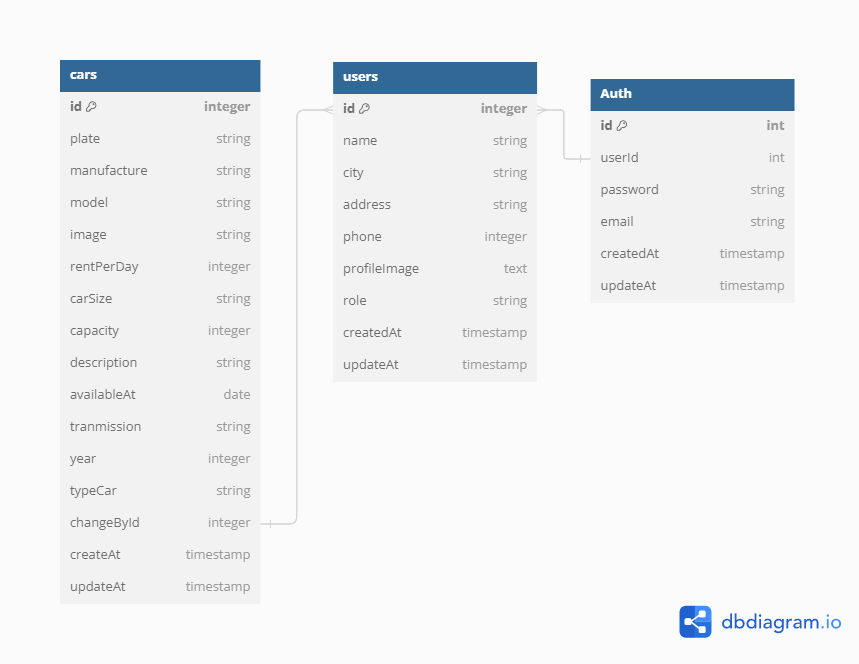

<h1 align="center">
  <br>
  Challange Chapter 5 Rizki Mauludin Yoga Prasetyo - FSW1 [Auth]
  <br>
</h1>

## Database Structure



## KM x Binar Academy Batch 6

### Data Fasil

|                |                      |
| -------------- | -------------------- |
| Kelas          | FSW 1                |
| Fasilitator    | Imam Taufiq Hermawan |
| ID Fasilitator | F-FSW24001086        |
|                |                      |

### Dibuat oleh

| Nama      | ID Peserta    |
| ------------------ | ------------- |
| Rizki mauludin Y.P | FSW2402KM6023 |

### Setup

#### 1. Node.js

Install seluruh package yang ada pada package.json dengan perintah seperti berikut:

```
npm install
```

#### 2. Download Requirement

Install Postgress dan juga PGAdmin(Optional Yang penting DBMS), Serta sudah daftar pada website imageKit[Image Hosting Optional]
[pgAdmin](https://www.pgadmin.org/download/) | [PostgreSQL Server](https://www.postgresql.org/download/) | [ImageKit](https://imagekit.io/)

#### 3. Setup Database via .env

Agar dapat berjalan perlu menambahkan data pada .env untuk bisa connect ke database, contoh isi dari .env bisa dilihat pada .env-example

```
DB_USERNAME=
DB_PASSWORD=
DB_NAME=
DB_PORT=
DB_HOST=
PORT=
JWT_SECRET=
JWT_EXPIRED=

IMAGEKIT_PUBLIC_KEY=
IMAGEKIT_PRIVATE_KEY=
IMAGEKIT_URL=
```

#### 4. Setup Database

```
npm run db-create
npm run db-migrate
npm run db-seed
```

#### 5. Menjalankan server

Untuk menjalankan server, dapat digunakan perintah berikut:

```
npm run dev
```

Untuk melihat antarmuka, dapat menggunakan link berikut [example port->3000]:

```
http://localhost:8000
```

## Api Docs

| Method | Endpoint   | Example                                      | 
| ------ | -----------| -------------------------------------------- | 
| Get    | /api-docs  | http://localhost:8000/api-docs/              | 
